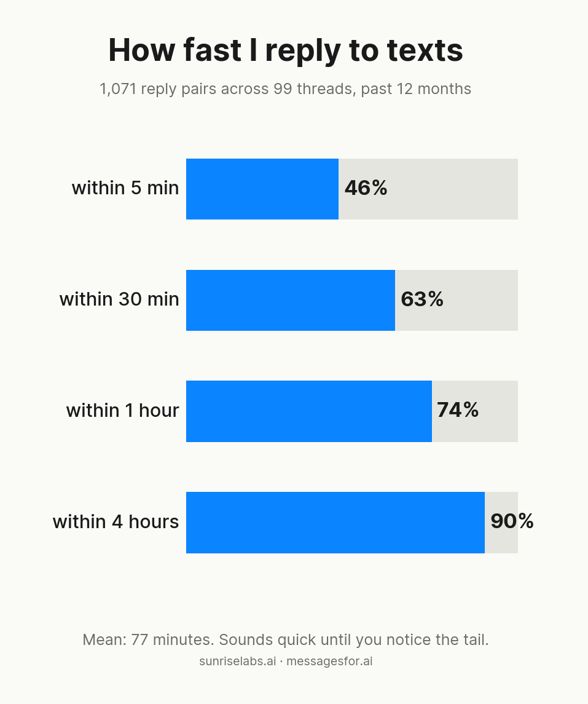
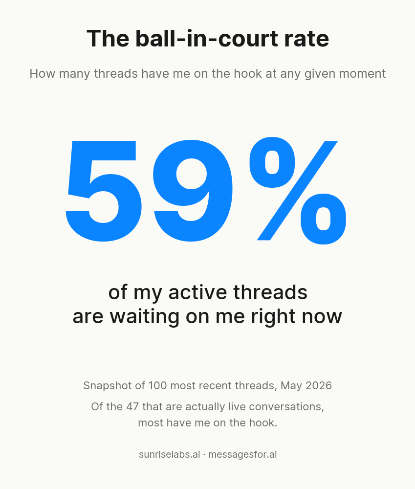
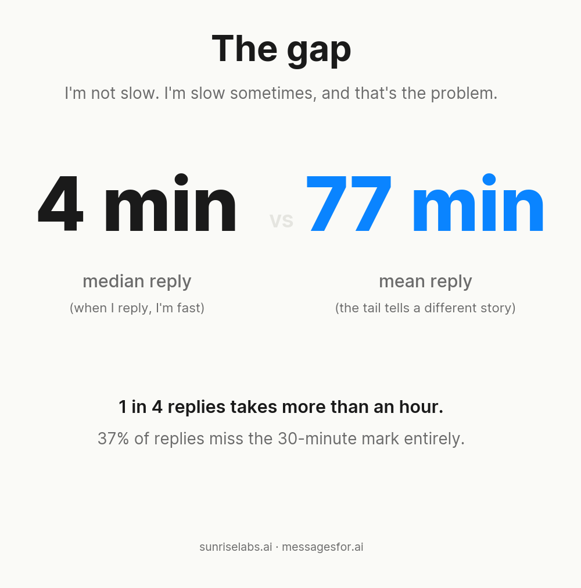
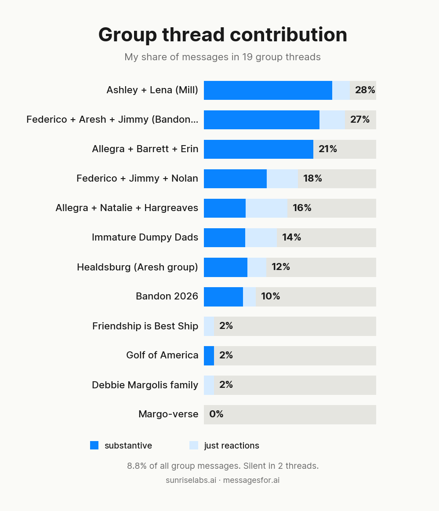

# Texting Wrapped — May 2026

**Verdict: My wife is right. I'm a bad texter.**

## The numbers

I ran a reply-latency analysis on 1,071 inbound messages across 99 threads from the past year. For each message someone sent me, I measured how long it took me to reply (capped at 16 hours, so naturally-dead conversations don't poison the stat).

63% of my replies land within 30 minutes. 37% don't. My mean reply time is 77 minutes. 1 in 4 replies takes more than an hour. At any given moment, 59% of my active threads have the ball in my court.

## The gap

The mean-vs-median story is the interesting one. My median reply is 4 minutes (when I reply, I'm fast). My mean is 77 minutes. The gap is the tail: a small number of replies that take hours or days drags the average up by 20x.

I'm not slow. I'm slow sometimes, and that's the actual problem.

## The group thread reveal

When I dug into group threads, the picture got worse. I analyzed 19 group threads (884 messages, 78 from me). My contribution rate is 8.8% of all messages. In functional/logistics groups (Bandon planning, neighbors) I'm fully engaged at 20-28%. In larger social friend groups (Friendship is Best Ship, Golf of America), I contribute 2% or less. Two threads had zero messages from me over the sample window.

The reaction rate is a red herring. I react at ~31%, others react at ~33%. The issue isn't that I'm a thumbs-up-only participant. The issue is that I often don't show up at all in big social groups.

## What I'd do with this

Three obvious moves:

1. **Reply queue**: a daily agent that surfaces threads over 48 hours with no reply and drafts a response for each.
2. **Voice-cloned drafts**: same agent, but it writes in my texting voice instead of generic chat-bot voice.
3. **Group thread nudges**: a weekly nudge for the social groups I keep going silent in.

All three are coming in the messagesfor.ai suite.

## Methodology

- Tool: [iMessage MCP](https://github.com/Sunrise-Labs-Dot-AI/imessage-mcp) (read access to Messages.app via Claude)
- Scope: 1:1 and small group threads (≤3 others), past 12 months. Excluded my wife (the benchmark, not data), spam, and automated threads.
- Window cap: 16 hours per reply pair. Larger gaps treated as conversation death.
- Group analysis: separate run on 19 group threads (4+ participants).

All processing local on my Mac. No data left the machine.

---

*Run your own Texting Wrapped at [messagesfor.ai](https://messagesfor.ai). Skill source on [GitHub](https://github.com/Sunrise-Labs-Dot-AI/messagesfor-ai-suite).*
